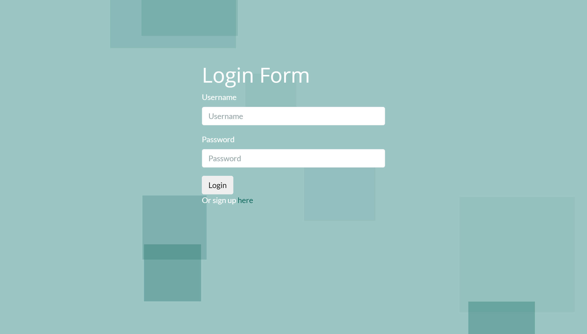
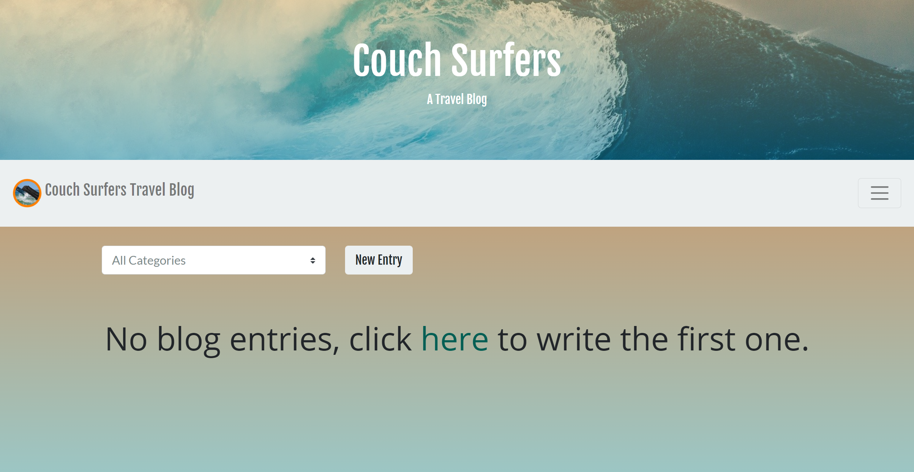
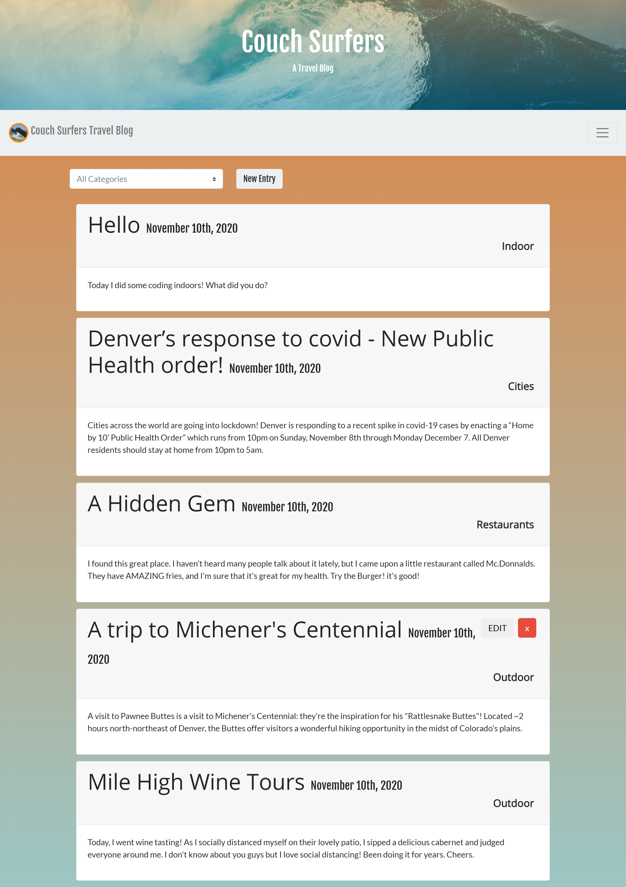
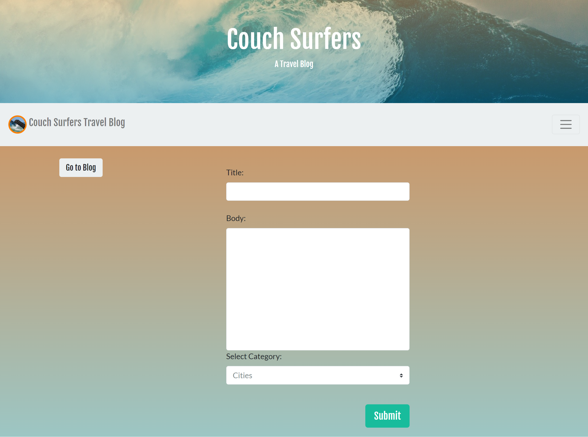
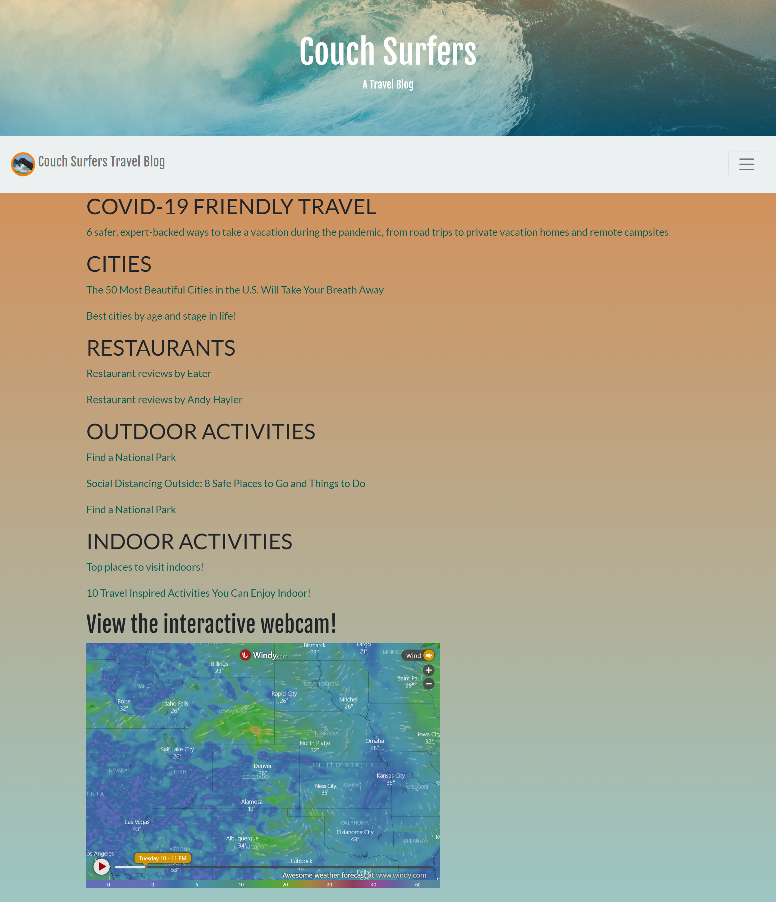
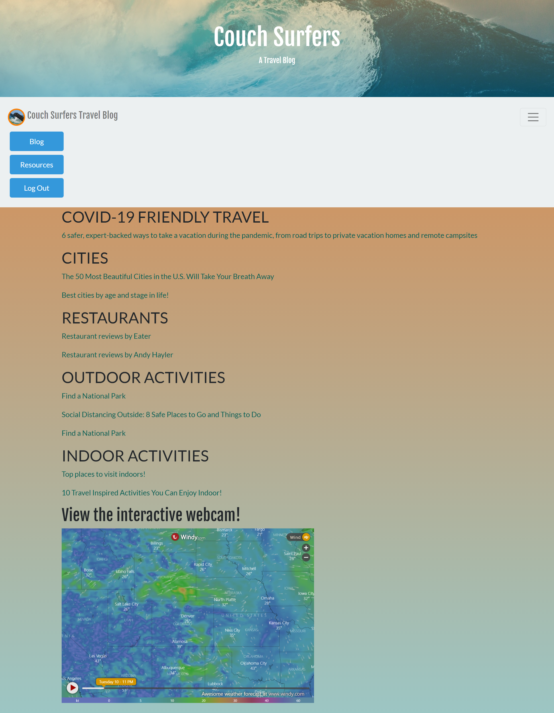

# Couch Surfers Travel Blog

## Table of Contents

* [Description](#description)
* [Links](#links)
* [Screenshots](#screenshots)
* [Installation](#installation)
* [Usage](#usage)
* [Technologies Used](#technologies)
* [Tests](#tests)
* [Credits](#credits)
* [Contributing](#contributing)
* [Questions](#questions)
* [License](#license)

## Description

This is a miniblog (entries of 500 characters or less) site using Node.js, Express, Express Handlebars, Sequelize, Passport, and tsparticles. Upon page load, the user is met with a login page; if they are not yet members of the site, they should click on the link below the login form to go to the sign-up page and fill out the sign-up form. After signing up, they will be redirected back to the login page, where they can then log in. They will then be taken to the blog page, which will initially be empty but for a statement to that effect, but will show blog posts from all users after such posts have been entered. To make a new blog post, click the "New Entry" button at the top of the page, which will take the user to a page on which they can enter their blog post, including a title, body, and a dropdown menu with a predefined selection of categories. Upon clicking "Submit," the user is taken back to the blog page (as will the "Go to Blog" button, if the user changes their mind about creating a post), where they will see their post. The dropdown menu at the top of the "blog" page allows the user to sort posts by category. Clicking on the hamburger button in the top right corner reveals a dropdown navbar, where the user can navigate to the login page; the blog; a resources page showing information about cities, restaurants, indoor activities, outdoor activities, and an interactive webcam; or sign out.

## Links

[Deployed application on Heroku](https://dry-scrubland-38194.herokuapp.com/)

## Screenshots

Landing & login page:

Sign-up page:

Empty blog page:

Blog page with posts:

Entry page:

Resources page:

Resources page with expanded navbar:

## Installation Instructions

npm i

## Usage

This site is intended to be used to allow users to share information with each other about their travel adventures.

## Technologies Used

Node.js, Express, Express Handlebars, Sequelize, Passport, tsparticles

## Tests

npm run test

## Credits

N/A

## Contributing

Jessica Anocibar, Laura Cole, Madeline Cowell, Devon Phillips, Joshua Thompson, Alec Rewinkel

## Questions

Our gitHub profiles:
[Jessica Anocibar](https://github.com/jessicaano92), [Laura Cole](https://github.com/LauraCole1900), [Madeline Cowell](https://github.com/MadelineCowell), [Devon Phillips](https://github.com/devonp702), [Joshua Thompson](https://github.com/Laika-Beats), [Alec Rewinkel](https://github.com/arewinkl)

## License

.